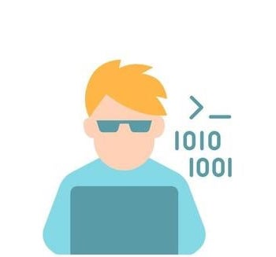

# Hi 👋, I am Quy 


[](https://www.linkedin.com/in/quy-doan-56516512/)


###  A little more about me...

```ruby

me = Developer.new(name: 'Quy Doan',
                   experience: '15 years',
                   company: 'Samsung Ads',
                   role: 'Senior Software Developer')

me.extend(FullStackSkills)
me.extend(DevOpsSkills)


class Developer
    attr_reader :name, :experience, :company
    def initialize(name: , experience:, company:, role: )
      @name = name
      @experience = experience
      @company = company
      @role = role
    end
end

module FullStackSkills
    def programing_languages
      %w(ruby javascript typescript html css dart go elixir python)
    end

    def databases
      %w(postgresql redis mongodb firestore mysql cassandra)
    end

    def frameworks
      %w(rails react flutter angular backbone)
    end
    alias_method :libraries, :frameworks

    def webservers
      %w(nginx haproxy puma)
    end
end

module DevOpsSkills
    def devops
      %w(docker k8s openshift helm aws google-cloud concourse heroku)
    end
end

```

### ✨ Award ✨

* 🥈 Startup Weekend - Eco-Social Impact - Montreal, Canada (2018)
* 🥈 Up Hackathon - Health UP Hackathon - Singapore (2013)
*  Hackathon - Santiago, Chile (2013)

----


<!--START_SECTION:waka-->


**🐱 My GitHub Data** 

> 🏆 39 Contributions in the Year 2022
 > 
> 📦 103.3 kB Used in GitHub's Storage 
 > 
> 🚫 Not Opted to Hire
 > 
> 📜 57 Public Repositories 
 > 
> 🔑 27 Private Repositories  
 > 
📊 **This Week I Spent My Time On** 

```text
⌚︎ Time Zone: America/Toronto

💬 Programming Languages: 
No Activity Tracked This Week

🔥 Editors: 
No Activity Tracked This Week

🐱‍💻 Projects: 
No Activity Tracked This Week

💻 Operating System: 
No Activity Tracked This Week

```

**I Mostly Code in Ruby** 

```text
Ruby                     20 repos            ███████████░░░░░░░░░░░░░░   44.44% 
JavaScript               17 repos            █████████░░░░░░░░░░░░░░░░   37.78% 
TypeScript               6 repos             ███░░░░░░░░░░░░░░░░░░░░░░   13.33% 
Elixir                   1 repo              ░░░░░░░░░░░░░░░░░░░░░░░░░   2.22% 
Shell                    1 repo              ░░░░░░░░░░░░░░░░░░░░░░░░░   2.22%

```


**Timeline**

 


 Last Updated on 13/01/2022
<!--END_SECTION:waka-->
