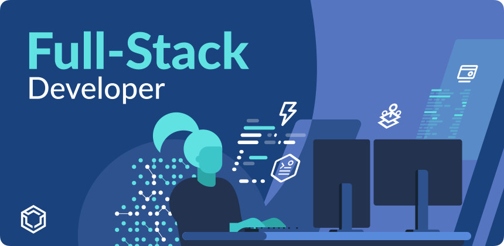
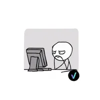

# Hello there, I am Quy 


###  A little more about me...

```ruby

me = Developer.new(name: 'Quy Doan',
                   experience: '15 years',
                   company: 'Samsung Ads',
                   role: 'Senior Software Developer')

me.extend(FullStackSkills)
me.extend(DevOpsSkills)


class Developer
    attr_reader :name, :experience, :company
    def initialize(name: , experience:, company: )
      @name = name
      @experience = experience
      @company = company
    end
end

module FullStackSkills
    def programing_languages
      %w(ruby javascript typescript html css dart go elixir python)
    end

    def databases
      %w(postgresql redis mongodb firestore mysql cassandra)
    end

    def frameworks
      %w(rails react flutter angular backbone)
    end
    alias_method :libraries, :frameworks

    def webservers
      %w(nginx haproxy puma)
    end
end

module DevOpsSkills
    def devops
      %w(docker k8s openshift helm aws google-cloud concourse heroku)
    end
end

```

### ✨ Award ✨

* 🥈 Startup Weekend - Eco-Social Impact - Montreal, Canada (2018)
* 🥈 Up Hackathon - Health UP Hackathon - Singapore (2013)
*  Hackathon - Santiago, Chile (2013)

----


<!--START_SECTION:waka-->
<!--END_SECTION:waka-->
